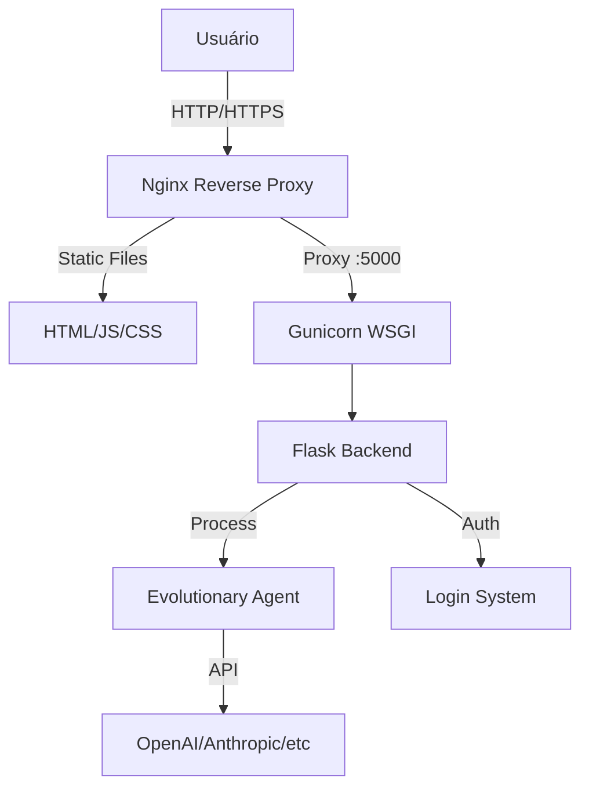

# 🗺️ Mapa de Deploy e Infraestrutura Hostinger

Este documento detalha o plano de execução para colocar o sistema Prometheus online no VPS da Hostinger, incluindo configuração de servidor, segurança e acesso.

## 1. Arquitetura de Deploy

## 2. Detalhes do Servidor (VPS)

- **Provider:** Hostinger
- **Host:** 72.62.9.90 (Msc.Hostinger)
- **OS:** Ubuntu 24.04 LTS
- **Specs:** 2 vCPU, 8GB RAM, 100GB Disk
- **Serviços:**
  - `nginx`: Servidor Web e Proxy Reverso (Porta 80/443)
  - `prometheus.service`: Serviço Systemd para manter o backend rodando 24/7
  - `python3`: Runtime da aplicação

## 3. Plano de Execução (Automático)

### Fase 1: Preparação do Código (Local)
1. **Implementar Autenticação:**
   - Criar `login.html`.
   - Adicionar endpoint `/api/login` no backend.
   - Proteger rotas do dashboard.
2. **Configurar Scripts de Deploy:**
   - Atualizar `hostinger_vps.py` para configurar Nginx e Systemd automaticamente.

### Fase 2: Provisionamento do Servidor (Remoto)
1. **Instalação de Dependências:**
   - Atualizar `apt`.
   - Instalar `nginx`, `python3-venv`, `git` (se necessário).
2. **Configuração de Segurança:**
   - Configurar Firewall (UFW) para permitir SSH, HTTP, HTTPS.

### Fase 3: Deploy da Aplicação
1. **Upload de Arquivos:**
   - Transferir código fonte para `/var/www/prometheus`.
2. **Configuração do Ambiente:**
   - Criar Virtual Environment (`venv`).
   - Instalar `requirements.txt`.
   - Configurar variáveis de ambiente (`.env`).

### Fase 4: Configuração de Serviços
1. **Systemd (Backend 24/7):**
   - Criar serviço `prometheus` para iniciar automaticamente no boot e reiniciar em caso de falha.
2. **Nginx (Frontend + Proxy):**
   - Configurar bloco de servidor para servir `dashboard.html` e `login.html`.
   - Configurar proxy reverso para API (`/api/*` -> `localhost:5000`).

### Fase 5: Validação
1. **Testes de Conectividade:**
   - Verificar status dos serviços.
   - Testar acesso externo via IP.

## 4. Credenciais de Acesso (Pós-Deploy)

- **URL:** http://72.62.9.90
- **Login:** `admin` (Configurável via .env)
- **Senha:** (Será definida no .env do servidor)

---
**Status:** 🚀 Em Execução...
